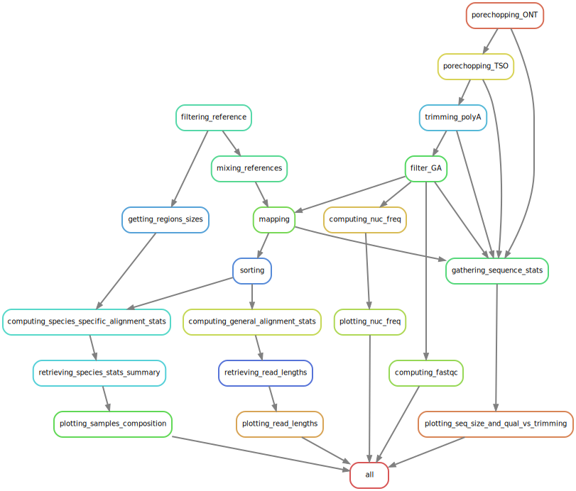

# MinION_seq_analysis_pipeline
Analysis pipeline for long-reads MinION sequencing data.



## Analysis naming

From workflow creation to 01/06/2025, analysis were named after the following convention:

```
<EXP NAME>_<ANALYSIS N° FOR THIS EXP>
```

...where `<EXP NAME>` usually was `EXPYYMMDD`, using the date of the sequencing experiment.

From 02/06/2025 onwards, the following naming convention is preferred:


```
<EXP N°>_<BASECALLING TYPE & N°>_<ANALYSIS N°>
```

...where:
- `<EXP NAME>` usually will only retain `YYMMDDXX`, using the date of the wetlab experiment _start_ as chosen by the biologist in MinKNOW plus the global number of the sequencing experiment;
- `<BASECALLING TYPE & N°>` contains one letter for the basecaller (M for MinKNOW, D for the `dorado_basecall_server`), the three-letters code for the basecalling quality (FAS, HAC, SUP) and the number of this type of basecalling for that experiment;
- `<ANALYSIS N°>` is the number of the analysis for this unique basecalled sequences.

For instance, the 2nd analysis of the first post-run Super-Accuracy basecalling of the sequences obtained from the third sequencing experiment, for which the RNA treatment started on April 17th 2025, will be:

`25041703_DSUP1_2`
