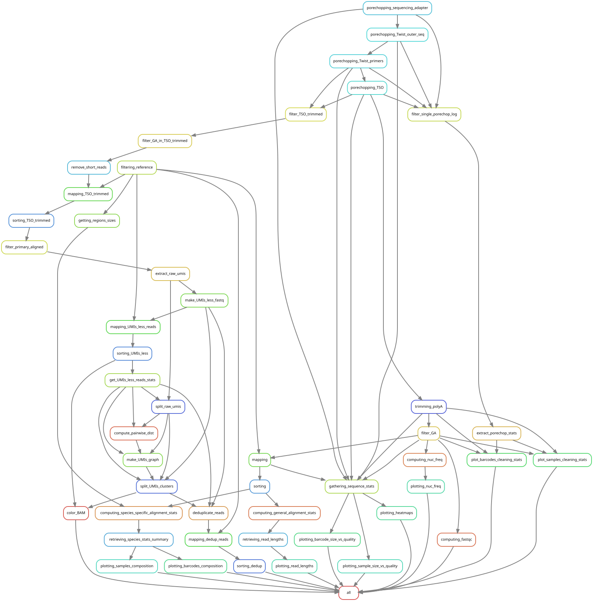

# Analysis Pipeline for MinION Sequencing Data
This repository contains most of what was developped at CEA/CNRHG to analyze
the data produced in BV PhD context. The documentation below helps use the
analysis pipeline. **/!\\ It was partially generated using Claude Opus 4.6
using an old version of the repository zip archive. /!\\**

The MinION-Seq-Analysis Pipeline is meant to be ran on the **lab's cluster**.
It takes as input the demultiplexed fastq files produced on the MinION
sequencing laptop - sequencing itself, basecalling, chimeric reads splitting
and custom demultiplexing are handled on that laptop by
[`MinION_PC_computing`](https://github.com/SimiliSerpent/MinION_PC_computing)
and are *not* covered here.

---

## Running an analysis (*Summary*)

1. **Import** the demultiplexed FASTQ files from the acquisition laptop into
   the project's scratch directory on the cluster.
2. **Write a short naming file** (`<EXP_ID>.barcodes`) that maps each
   barcode to a sample name.
3. **Edit `set_config.sh`** with four variables: experiment id, threads,
   target species, barcoding kit. Also make sure the location of the analysis
   directory is available in the right shell variable. Set the config.
4. **Submit the master job** (`run_snakemake.sh`). Snakemake handles the
   rest: trimming, mapping against the selected references, statistics and
   plots.
5. **Collect the plots** from `Analysis/results/<EXP_ID>/`.

The pipeline consists of multiple steps from reads trimming to statistics
plotting. The *Directed Acyclic Graph* (DAG) of all jobs performed on one
dataset can be as follows:



---

## Conventions and repository spirit

### 1. Experiment / analysis identifier

Every run of the pipeline is identified by a single string that is used as
both a directory name and a prefix on all output files. Since 2025-06-02 the
convention is:

```
<EXP_N°>_<BASECALLING_TYPE_&_N°>_<ANALYSIS_N°>
```

Example: **`25041703_DSUP1_2`** means

| Token | Meaning |
| --- | --- |
| `25041703` | Seq. start date `YYMMDD` (2025-04-17) + global exp. nb (`03`) |
| `D` | Basecaller: `D` = `dorado_basecall_server`, `M` = MinKNOW |
| `SUP` | Quality: `SUP`, `HAC` or `FAS` |
| `1` | First basecalling of that type for this experiment |
| `2` | Second analysis run on that basecalled data |

In other words, that is the 2nd analysis of the 1st basecalling/demultiplexing
treatment of the 3rd sequencing analysis (sequencing took place on 2025-04-17)
basecalled using Dorado (as opposed to a live basecalling performed by MinKNOW)
in Super Accuracy mode.

Rules of thumb:

- No spaces, accents or dots.
- Increment `<ANALYSIS_N°>` when re-running with different parameters,
  rather than overwriting the previous analysis directory.
- The `<EXP_N°>` in this identifier resembles the one the biologist choses
  in MinKNOW.

(Legacy analyses prior to 2025-06-02 use the older form `EXPYYMMDD_<N>` —
still recognised, *but do not use this form for new work.*)

### 2. Directory layout

The pipeline expects the project to live at the path contained in the
environment variable `CAPASVIR_ANALYSIS`.

```
$CAPASVIR_ANALYSIS/
├── Analysis/
│   ├── snakemake/            ← you run the pipeline from here
│   │   ├── Snakefile.py
│   │   ├── rules/config.py
│   │   ├── set_config.sh     ← you edit this
│   │   └── run_snakemake.sh  ← you submit this
│   ├── scripts/              ← trimming / stats helpers (Python + bundled Porechop)
│   └── results/
│       └── <EXP_ID>/         ← all plots and stats go here
└── Data/
    ├── seq_data/
    │   └── <EXP_ID>/         ← you place input FASTQs here
    │       ├── demultiplexed/
    │       │   ├── barcode01.fastq
    │       │   ├── barcode02.fastq
    │       │   └── ...
    │       └── <EXP_ID>.barcodes
    └── references/
        ├── public/           ← reference FASTAs (hs38dh, NC_045512.2, …)
        ├── ROI/              ← region-of-interest lists per species
        ├── sizes/            ← (auto-generated by the pipeline)
        └── snakeref/         ← (auto-generated: filtered + concatenated refs)
```

---

## Performing an analysis

### 1. Import the demultiplexed FASTQs

The unzipped fastqs have to be gathered in a `demultiplexed` directory directly
under the experiment directory in `Data/seq_data/`. This can be done manually
or by using `Analysis/scripts/pipeline/import_demuxed.sh`.

In order to use that script, define the following environement variables to
provide the location of the sequencing data on the distant sequencing device:

| Environment variable | Meaning |
| --- | --- |
| `SEQ_USER` | Username required to access the sequencing data |
| `SEQ_DEVICE` | Ip adress of the sequencing device |
| `SEQ_LOCATION` | Path to sequencing data on the sequencing device |

This can be done as follows:

```bash
export SEQ_USER="user"
export SEQ_DEVICE="0.0.0.0"
export SEQ_LOCATION="/data"
```

Then, edit the variables hardcoded directly in the script:

| Variable | Meaning |
| --- | --- |
| `PROT_GROUP_ID` | Name given to the experiment in MinKNOW |
| `SAMPLE_ID` | Name given to the sample in MinKNOW |
| `START_TIME` | Sequencing starting time |
| `MINION_ID` | MinION ID |
| `FLOWCELL_ID` | Flowcell ID |
| `SHORT_PROT_GROUP_ID` | First 8 characters of the protocol_run_id |
| `EXP_NAME` | Name given to this analysis on  the cluster (this is <EXP_ID>) |

And run:

```bash
cd $CAPASVIR_ANALYSIS
. ./Analysis/scripts/pipeline/import_demuxed.sh
```

### 2. Write the barcodes naming file

Create `$CAPASVIR_ANALYSIS/Data/seq_data/<EXP_ID>/<EXP_ID>.barcodes`. It is a
**single-line**, **comma-separated** file with one `<nb>=<sample_name>`
pair per barcode:

```
8=Paris_20250417_A,9=Lyon_20250417_B,10=Marseille_20250417_C
```

Formatting rules:

- One line only.
- `<nb>` is an integer (`8`, not `08`) — the pipeline pads it internally.
- `<sample_name>` should contain no commas, no `=` (simple quotes are allowed).

Only list the barcodes you want labelled as samples in the
sample-composition plots. Unlisted barcodes still go through the
pipeline; they simply appear as `barcodeNN` in the barcode-level plots
but are excluded from the sample-level plots.

### 3. Check that the references are in place

The pipeline builds its mapping reference on the fly by concatenating the
regions of interest of each requested species. For each species targeted in the
analysis, the following two files must exist:

```
$CAPASVIR_ANALYSIS/Data/references/public/<species>.fa
$CAPASVIR_ANALYSIS/Data/references/ROI/<species>_regions.txt
```

The former file contains the reference sequence fasta for that species. The
latter contains a list of regions = contigs = chromosomes to use (see
`$CAPASVIR_ANALYSIS/Data/references/README.md` for the more details).

The following species have files already existing the cluster: `human`,
`mouse`, `SARSCoV2`, `Ecoli`, `Saureus`, `lambda` (see aforementionned
`README.md` for public accessions).
Files only exist on the public repo for `SARSCoV2` (for testing purposes).

The `snakeref/` and `sizes/` subdirectories are regenerated by the
pipeline; no action needed.

### 4 — Set the analysis parameters

```bash
nano $CAPASVIR_ANALYSIS/Analysis/snakemake/set_config.sh
```

The file contains exactly four parameters to set:

| Parameter | Meaning | Example value |
| --- | --- | --- |
| `EXP_ID` | Analysis identifier (see above) | `23101600_DSUP0_0` |
| `NTHREADS` | Cores requested for the job (use 32) | `32` |
| `SPECIES` | Species targeted in the analysis (comma-separated, no spaces) | `human,SARSCoV2` |
| `BARCODES` | Barcoding kit used in the wet lab library preparation | `TWIST-LRLP-SHv2E` |

**`BARCODES`** should be one of:
  - `TWIST-LRLP-SHv2E` — Twist capture library barcodes
  - `ONT-EXP-PBC001` — ONT PCR barcoding kit
  - `UNBARCODED` — single-sample run *(advanced — see §9.4)*

Memory is fixed at 300 GB in `run_snakemake.sh` regardless of what is defined
here; change it accordingly with `NTHREADS` if using another amount than 32
CPUs.

### 5 — Start the analysis

Submit the master job from `$CAPASVIR_ANALYSIS/Analysis/snakemake`:

```bash
. ./set_config.sh
ccc_msub run_snakemake.sh
```

What this does:

- Loads the required modules: `fastqc`, `gcc`, `minimap2`, `python`,
  `samtools`, `snakemake`.
- Launches Snakemake on a single node with `${NTHREADS}` cores and 300 GB
  of memory, up to 24 hours of walltime (see the `#MSUB` header of
  `run_snakemake.sh` for the exact values).
- Snakemake schedules its rules using those cores; it does **not** submit
  one SLURM job per rule. Everything runs inside this master job.

Monitor:

```bash
ccc_mstat -u $USER                         # is the job still running?
tail -f $CAPASVIR_ANALYSIS/Analysis/results/<EXP_ID>/logs/snakemake.<JOBID>.out
tail -f $CAPASVIR_ANALYSIS/Analysis/results/<EXP_ID>/logs/snakemake.<JOBID>.err
```

---

## Analysis outputs

All results land under `$CAPASVIR_ANALYSIS/Analysis/results/<EXP_ID>/`:

```
results/<EXP_ID>/
├── config.txt                            # record of the config this run used
├── logs/
│   ├── cleaning/                         # one log per (barcode, trim step)
│   └── snakemake.<JOBID>.{out,err}
├── read_cleaning/
│   ├── barcodes_cleaning_stats.png       # % reads surviving each trim step, per barcode
│   ├── samples_cleaning_stats.png        # same, restricted to named samples
│   ├── GA_filtering/                     # per-barcode GA-filtering histograms + JSON
│   └── trimming_stats/polyA_trimming/    # per-barcode polyA histograms + JSON
├── read_lengths/
│   └── <barcode>_read_lengths_histo.png  # post-cleaning read-length distribution
├── size_vs_quality/
│   ├── <EXP_ID>_barcode_size_vs_quality{,_3000,_1500,_5_percent}.png
│   ├── <EXP_ID>_sample_size_vs_quality{,_5_percent}.png
│   ├── <EXP_ID>_barcode_heatmap.png
│   └── <EXP_ID>_sample_heatmap.png       # density heatmaps across trim states
├── nuc_freq/
│   └── <EXP_ID>_nuc_freq.png             # nucleotide composition after full cleaning
├── composition/
│   ├── <EXP_ID>_barcodes_composition.png                       # raw counts
│   ├── <EXP_ID>_barcodes_composition_with_total.png
│   ├── <EXP_ID>_barcodes_normalized_composition.png            # normalised to ROI size
│   ├── <EXP_ID>_barcodes_normalized_composition_with_total.png
│   └── <EXP_ID>_samples_*.png                                  # same, named samples only
├── alignments_stats/
│   ├── <barcode>_map2_snakeref.samstats                        # `samtools stats` output
│   └── <species>/<barcode>.<species>.{samstats,summary}        # per-species slice
└── fastqc/
    └── <barcode>_porechopped_6_GA_fastqc.{html,zip}            # FastQC on fully-cleaned reads
```

The **four plots you are most likely to want first**:

1. `read_cleaning/barcodes_cleaning_stats.png` — did cleaning behave
   sensibly per barcode?
2. `composition/<EXP_ID>_samples_normalized_composition.png` — per-sample
   breakdown of targeted species, normalized across all barcodes.
3. `size_vs_quality/<EXP_ID>_sample_heatmap.png` — overall read
   size-vs-quality health check.

---

## Dry-run and DAG

If anything feels uncertain, run a dry run from the login node — it checks
inputs and the rule graph without executing:

```bash
cd $CAPASVIR_ANALYSIS/Analysis/snakemake
. ./set_config.sh
module load fastqc
module load gcc
module load minimap2
module load python
module load samtools
module load snakemake
snakemake -np --snakefile Snakefile.py | head -60
```

To plot the Directed Acyclic Graph for the analysis, use `make_dag.sh` or
`make_dag_simple.sh` - the latter produces a much more human-readable graph
by removing all input/output file names.

---

## Cheat sheet

```bash
# For each new experiment:
# 1. import FASTQs after you edited import_demuxed.sh and did the right exports
export SEQ_USER="user"
export SEQ_DEVICE="0.0.0.0"
export SEQ_LOCATION="/data"
export CAPASVIR_ANALYSIS="/path/to/repo"

nano $CAPASVIR_ANALYSIS/Analysis/scripts/pipeline/import_demuxed.sh
. $CAPASVIR_ANALYSIS/Analysis/scripts/pipeline/import_demuxed.sh

# 2. write the .barcodes file
echo '8=sampleA,9=sampleB,10=sampleC' \
    > $CAPASVIR_ANALYSIS/Data/seq_data/<EXP_ID>/<EXP_ID>.barcodes

# 3. edit the four analysis parameters
nano $CAPASVIR_ANALYSIS/Analysis/snakemake/set_config.sh

# 4. dry run, then submit
cd $CAPASVIR_ANALYSIS/Analysis/snakemake
. ./set_config.sh
ccc_msub run_snakemake.sh

# 5. watch it
ccc_mstat -u $USER
tail -f $CAPASVIR_ANALYSIS/Analysis/results/<EXP_ID>/logs/snakemake.*
```

---

## Getting help

Contact the lead developer or:
- **Pipeline bugs / questions**: open an issue on
  [`MinION_seq_analysis_pipeline`](https://github.com/SimiliSerpent/MinION_seq_analysis_pipeline/issues).
- **Cluster issues (queues, quotas, modules)**: cluster helpdesk.
- **Laptop-side basecalling / demuxing**: see the companion repo
  [`MinION_PC_computing`](https://github.com/SimiliSerpent/MinION_PC_computing).
